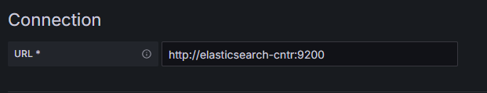
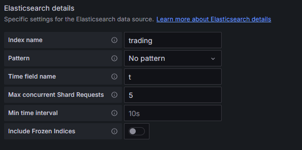
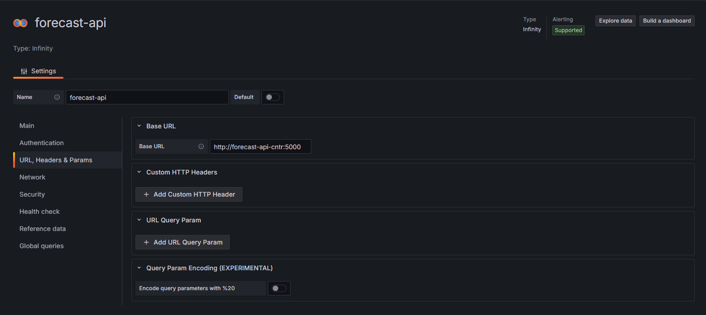
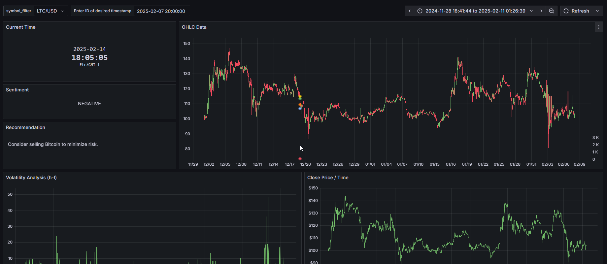
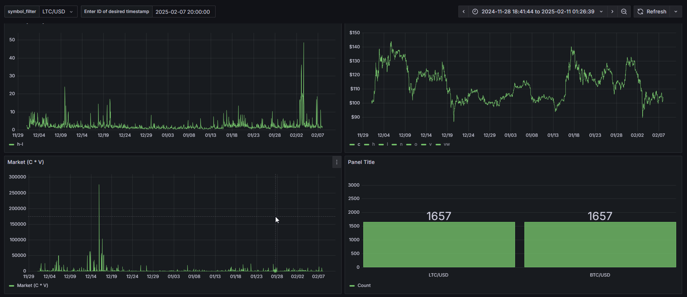
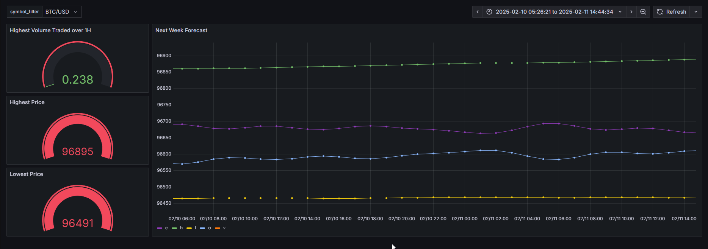

# REAL-TIME-TRADING-DATA-FORECAST-LLM-GRAFANA

## 📑 Table of Contents
1. [📌 Project Overview](#-project-overview)
2. [🔹 Key Features](#-Key-features)
3. [🎯 Objectives:](#-Objectives)
4. [📁 Directory Structure](#-directory-structure)
5. [🏗️ Project Architecture](#-project-architecture)
6. [🚀 Getting Started](#-getting-started)
   - [Prerequisites](#prerequisites)
   - [Installation](#installation)
7. [🌐 Services](#-services)
8. [🔧 GitHub Actions Pipeline](#github-actions-pipeline)
    - [Pipeline Structure](#pipeline-structure)
9. [⚙️ Data Source Configurationn](#-Data-Source-Configuration)
10. [📊 Visualization & Demonstration](#-Visualization-Demonstration)
11. [🔮 Future Considerations](#-future-considerations)
12. [👨‍💻 Project By](#-project-by)

## 📌 Project Overview
The REAL-TIME-TRADING-DATA-FORECAST-LLM-GRAFANA project is designed to streamline trading data ingestion, forecasting, and visualization. It integrates multiple technologies to ensure high-performance data processing, accurate market predictions, and insightful analytics.

## 🔹 Key Features:
- **Efficient Data Ingestion**: Trading data is collected from the **Alpaca Brokerage API** using **Kafka**, ensuring seamless and scalable ingestion.
- **Big Data Processing**: The ingested data is processed and transformed using **Apache Spark** for efficient handling of large-scale financial data.
- **Search & Indexing**: The processed data is indexed in **Elasticsearch**, allowing for fast and scalable retrieval of trading insights.
- **Market Forecasting**: A **forecasting model** analyzes the last 30 days of trading data and predicts market trends for the next 7 days, aiding in informed decision-making.
- **AI-Powered Insights**: A **GPT-2-based LLM** generates **market recommendations** based on analyzed data, providing additional guidance for traders and analysts.
- **Data Visualization**: The entire pipeline is monitored and visualized using **Grafana**, offering **real-time dashboards** for tracking market performance and model predictions.

## 🎯 Objectives:
✅ Enable **scalable ingestion** of trading data using Kafka.
✅ Provide **accurate market forecasting** using historical trends.
✅ Enhance **searchability and retrieval** of market insights via Elasticsearch.
✅ Deliver **AI-driven recommendations** for trading strategies.
✅ Offer **intuitive visual analytics** through Grafana dashboards.

## 📁 Directory Structure
```python
REAL-TIME-TRADING-DATA-FORECAST-LLM-GRAFANA/
│-- .github/                      
│-- data_preparation/                
│   ├── Data Cleaning.ipynb         
│   ├── Forecasting_And_BenchMarking.ip  
│-- infra/                          
│   ├── elasticsearch/            
│   │   ├── create_index_elastic.py  
│   │   ├── custom_cmd.sh  
│   │   ├── Dockerfile.elastic  
│-- forecast-api/                    
│   ├── app/                          
│   │   ├── utils/                 
│   │   ├── main.py  
│   │   ├── requirements.txt  
│   │   ├── Dockerfile.forecast  
│-- grafana/                         
│   ├── forecasting-dashboard.json  
│   ├── trading-dashboard.json  
│-- LLM-api/                        
│   ├── app/  
│   │   ├── main.py  
│   │   ├── Dockerfile.llm  
│-- spark/                          
│   ├── Dockerfile.spark  
│   ├── spark_stream.py  
│   ├── docker-compose.yml  
│-- tests/                           
│   ├── test_api_utils.py  
│   ├── test_kafka_utils.py  
│-- utils/                           
│   ├── api_utils.py  
│   ├── kafka_utils.py  
│-- .gitignore  
│-- kafka_stream.py  
│-- README.md  
```

## 🏗️ Project Architecture


## 🚀 Getting Started

### Prerequisites

Ensure you have the following installed:

- **Python**: 3.8 or higher  
- **Git**  
- **Docker**  

### Installation

1. Clone the repository:  
   ```bash
   git clone https://github.com/EdamH/REAL-TIME-TRADING-DATA-FORECAST-LLM-GRAFANA.git
   cd REAL-TIME-TRADING-DATA-FORECAST-LLM-GRAFANA
   ```
2. Navigate to the infrastructure directory and start the services:  
    ```bash 
    cd infra
    docker-compose up -d
    ```
3. Run the Kafka stream processor:  
    ```bash 
    python kafka_stream.py

    ```
Once these steps are completed, the entire pipeline will be up and running, handling data ingestion, forecasting, and visualization. 🚀

# 🌐 Services

### Zookeeper
- *Purpose*: Manages and coordinates distributed services.
- *Image*: `docker.io/bitnami/zookeeper:3.8`

### Kafka
- *Purpose*: A distributed streaming platform that uses Zookeeper for managing clusters.
- *Image*: `docker.io/bitnami/kafka:3.3`
- *Depends On*: zookeeper

### Spark Master
- *Purpose*: Manages the Spark cluster and submits jobs.
- *Custom Dockerfile*: `spark/Dockerfile.spark`
- *Reason for Custom Build*: To install Python dependencies, Scala, and configure Spark with specific scripts.

### Spark Worker
- *Purpose*: Executes tasks in the Spark cluster.
- *Custom Dockerfile*: `spark/Dockerfile.spark`
- *Reason for Custom Build*: Shares the same build as Spark Master for consistency.

### Elasticsearch
- *Purpose*: Stores and indexes data for search and analytics.
- *Custom Dockerfile*: `elasticsearch/Dockerfile.elastic`
- *Reason for Custom Build*: To install Python dependencies and add custom scripts for index creation.

### Grafana
- *Purpose*: Visualizes and monitors data, especially from Elasticsearch and other services.
- *Image*: `grafana/grafana-enterprise`
- *Reason for Custom Build*: To integrate with Elasticsearch and provide custom data visualization features.

### Forecast API
- *Purpose*: Provides GPT-2 model recommendations and 7-day market forecasting.
- *Image*: `edamh158/trading-app:forecast-api`
- *Reason for Custom Build*: To host the GPT-2 recommendation model and 7-day forecasting functionality for market analysis.

## Custom Dockerfiles

### Spark Dockerfile
```bash 
# Start from the Bitnami Spark image Spark
FROM bitnami/spark:3.2.4

# Switch to root to install packages
USER root

# Update the package list and install python3-pip, curl, telnet, and other utilities
RUN apt-get update && \
    apt-get install -y python3-pip curl telnet && \
    rm -rf /var/lib/apt/lists/*

# Install Scala 2.12
RUN curl -LO https://downloads.lightbend.com/scala/2.12.15/scala-2.12.15.tgz && \
    tar -xzvf scala-2.12.15.tgz -C /opt/ && \
    rm scala-2.12.15.tgz && \
    mv /opt/scala-2.12.15 /opt/scala

# Set up environment variables for Scala
ENV SCALA_HOME /opt/scala
ENV PATH $PATH:$SCALA_HOME/bin

# Create the checkpoints directories and ensure the non-root user has write access
RUN mkdir -p /opt/bitnami/spark/checkpoints/trades && \
    chown -R 1001:1001 /opt/bitnami/spark/checkpoints

# Copy spark file into a container
COPY spark/spark_stream.py /opt/bitnami/spark/spark_stream.py

# Install the Elasticsearch client for Python
RUN pip install spark pyspark

# Switch back to the default user
USER 1001
```

### ElasticSearch Dockerfile
```bash 
FROM bitnami/elasticsearch:8.8.2

USER root

RUN apt-get update && apt-get install -y python3 python3-pip \
    && chown -R 1001:1001 /opt/bitnami/elasticsearch \
    && chmod 775 /opt/bitnami/elasticsearch

RUN pip3 install elasticsearch==8.8.2

COPY elasticsearch/create_index_elastic.py /usr/share/elasticsearch/scripts/create_index_elastic.py
COPY elasticsearch/custom_cmd.sh /usr/share/elasticsearch/scripts/custom_cmd.sh

RUN chmod +x /usr/share/elasticsearch/scripts/custom_cmd.sh

USER 1001

ENTRYPOINT [ "/opt/bitnami/scripts/elasticsearch/entrypoint.sh" ]
CMD [ "/usr/share/elasticsearch/scripts/custom_cmd.sh" ]    
```
### Elasticsearch Custom Command 

 ```bash 
 #!/bin/bash


. /opt/bitnami/scripts/liblog.sh

# Run the setup script
info "************************************ Starting Elasticsearch setup ************************************"
/opt/bitnami/scripts/elasticsearch/setup.sh 
info "************************************ Elasticsearch setup finished! ************************************"

# Run the default script script
info ""
/opt/bitnami/scripts/elasticsearch/run.sh &

# Wait for the Elasticsearch to start
info "************************************ Waiting for Elasticsearch to start ************************************"
while true; do
    curl -s http://localhost:9200 && break
    sleep 1
done

# Execute the Python script
info "************************************ Executing create_index_elastic  ************************************"

python3 /usr/share/elasticsearch/scripts/create_index_elastic.py

info "************************************ create_index_elastic executed successfully ************************************"


# Keep the container running
tail -f /dev/null
```
### Forecast API Dockerfile 
```bash 
# Use official Python 3.9 image as base
FROM python:3.9

# Set working directory for the app
WORKDIR /shared/httpd/forecast-api

# Copy only requirements first to leverage Docker caching
COPY ./forecast-api/app/requirements.txt /shared/httpd/forecast-api/app/requirements.txt

# Install dependencies
RUN pip install --no-cache-dir -r /shared/httpd/forecast-api/app/requirements.txt

# Copy the rest of the application
COPY ./forecast-api /shared/httpd/forecast-api

# Expose necessary port
EXPOSE 5000

# Start a shell to debug the container interactively
CMD ["python", "/shared/httpd/forecast-api/app/main.py"]

```

## 🔧 Github Actions Pipeline

This CI/CD pipeline automates the testing, building, and deployment of the distributed data processing and visualization platform. The pipeline is triggered by a push event in the GitHub repository, ensuring seamless integration and deployment of services like Kafka, Spark, Elasticsearch, and Grafana

### Pipeline Structure

The pipeline consists of the following jobs:

1. *Testing-Phase*:
 This job is responsible for setting up the environment, installing dependencies, running tests, and performing code linting.

 ```bash 
 Testing-Phase:
    runs-on: ubuntu-latest
    steps:
      - uses: actions/checkout@v4
      - name: Set up Python
        uses: actions/setup-python@v5
        with:
          python-version: '3.11.4'
      - name: Install dependencies
        run: |
          pip install --upgrade pip
          pip install -r requirements.txt
      - name: Test with pytest
        run: |
          pip install pytest pytest-cov
          pytest tests/ --doctest-modules --junitxml=junit/test-results.xml --cov=utils --cov-report=xml --cov-report=html
      - name: Lint with Ruff
        run: |
          pip install ruff
          ruff check --output-format=github .
        continue-on-error: true
      - name: Upload pytest test results
        uses: actions/upload-artifact@v4
        with:
          name: pytest-results
          path: |
            junit/test-results.xml
            htmlcov
        if: ${{ always() }}
 ```
2. *Build-and-Push-Images*: This job builds and pushes Docker images if there are changes in the infra/ directory. It depends on the successful completion of the Testing-Phase.

```bash
Build-and-Push-Images:
    runs-on: ubuntu-latest
    if: ${{ github.event_name == 'push' && contains(github.event.head_commit.modified, 'infra/') }}
    needs: Testing-Phase  
    steps:
      - name: Checkout code
        uses: actions/checkout@v4
      - name: Build and push Docker images
        env:
          DOCKER_HUB_USERNAME: ${{ secrets.DOCKER_HUB_USERNAME }}
          DOCKER_HUB_PASSWORD: ${{ secrets.DOCKER_HUB_PASSWORD }}
        run: |
          docker-compose -f infra/docker-compose.yml build
          echo "${DOCKER_HUB_PASSWORD}" | docker login -u "${DOCKER_HUB_USERNAME}" --password-stdin
          docker-compose -f infra/docker-compose.yml push
```
## ⚙️ Data Source Configuration

### 1. **Elasticsearch Data Source Configuration in Grafana**

**Step 1:** Access the Grafana interface.

**Step 2:** Go to the **Data Sources** section in the Grafana settings.

**Step 3:** Add a new data source and select **Elasticsearch** as the data source type.

**Step 4:** Specify the URL of your Elasticsearch cluster, usually `http://elastic-cntr:9200`.



**Step 5:** Choose the **Index Name** that Grafana will use to query the data from Elasticsearch. 

In this screenshot, we can see the configuration for the Elasticsearch data source in Grafana, where you specify the index pattern.



### 2. **Forecasting API Data Source Configuration in Grafana**

**Step 1:** Access the data source configuration interface in Grafana.

**Step 2:** Select **"Infinity"** as the data source type (the "Infinity" plugin allows Grafana to connect to an API source).

In this screenshot, you can see how to configure the "Infinity" API data source in Grafana, allowing Grafana to fetch and visualize prediction results directly from your API server.




## 📊 Visualization & Demonstration

### 1. **Trading Dashboard**

The Trading Dashboard provides in-depth analysis of market data, including:
- **OHLC (Open/High/Low/Close) Data** 
- **Volatility Analysis** 
- **Market Distribution of Symbols** 
- **Close Price vs Time**
- **GPT-2 Model Recommendations**
- **Sentiment Analysis of Trade Recommendations**

This dashboard consolidates real-time trading information, visualizing market behavior and recommending trading actions based on sentiment analysis. 

Here are two screenshots of the **Trading Dashboard**:

  
  
  
  

---

### 2. **7-Day Forecasting Dashboard**

The 7-Day Forecasting Dashboard provides predictions for the upcoming week, including:
- **Highest Volume Forecast**
- **Highest Price Forecast**
- **Lowest Price Forecast**

This dashboard helps visualize market trends for the next 7 days, allowing traders to plan ahead based on predicted market behavior.

Here’s a screenshot of the **7-Day Forecasting Dashboard**:

- **Forecasts for the Next Week:** Displays predicted market trends including highest volume, highest price, and lowest price.

  


## 🔮 Future Considerations

As we continue to enhance and scale this project, several key improvements can be implemented to increase efficiency, accuracy, and real-time capabilities.

### ✅ Transition to Real-Time Processing  
Currently, data ingestion is handled via **Kafka**, but processing is still batch-based. To achieve **true real-time trading analysis**, we could:  
- Implement **Spark Structured Streaming** to process Kafka streams in real-time.  
- Optimize data indexing in **Elasticsearch** to support real-time queries with minimal latency.  
- Integrate **Flink** or **Kafka Streams** for low-latency event processing.

### 🤖 More Advanced Recommendation Model  
The current **GPT-2-based LLM** could be upgraded to provide **higher-quality market insights**. Some improvements include:  
- Using **GPT-4 Turbo** or **Finetuned LLaMA models** for better financial text understanding.  
- Training a **Reinforcement Learning (RL)-based agent** to optimize trading recommendations dynamically.  
- Incorporating **sentiment analysis** on market news and social media (Twitter, Bloomberg feeds).

### 📊 Enhanced Market Forecasting  
- Improve the current forecasting model by integrating **LSTMs, Transformers (e.g., Time-Series BERT), or Temporal Graph Neural Networks**.  
- Utilize **multi-source data fusion** (economic indicators, news sentiment, trading volumes) for more robust predictions.  

### 🔒 Security & Compliance  
- Implement **data encryption** and secure API authentication for financial data protection.  
- Ensure compliance with **GDPR, MiFID II, and SEC regulations** regarding financial data storage and AI-based recommendations.  

By implementing these improvements, our project could evolve into a **fully automated, real-time, AI-powered trading assistant** capable of making highly informed decisions with minimal latency. 🚀  

## Project by
<a href="https://https://github.com/EdamH/REAL-TIME-TRADING-DATA-FORECAST-LLM-GRAFANA/graphs/contributors">
    
</a>